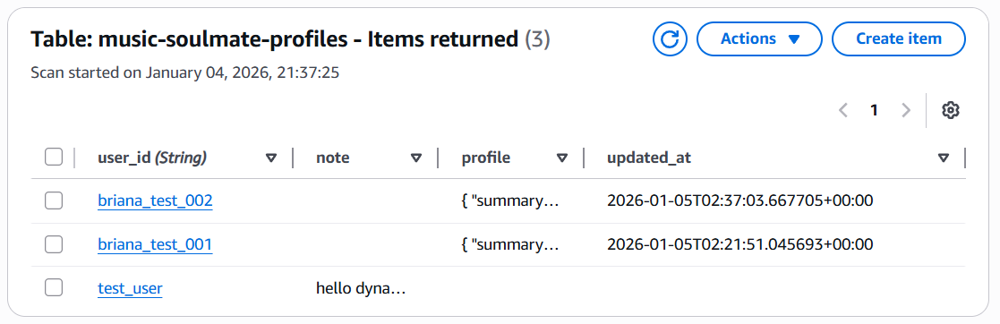
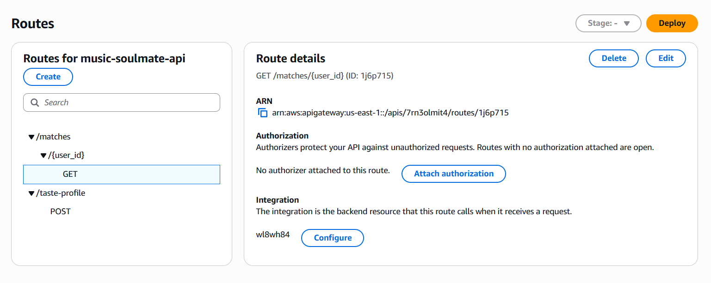
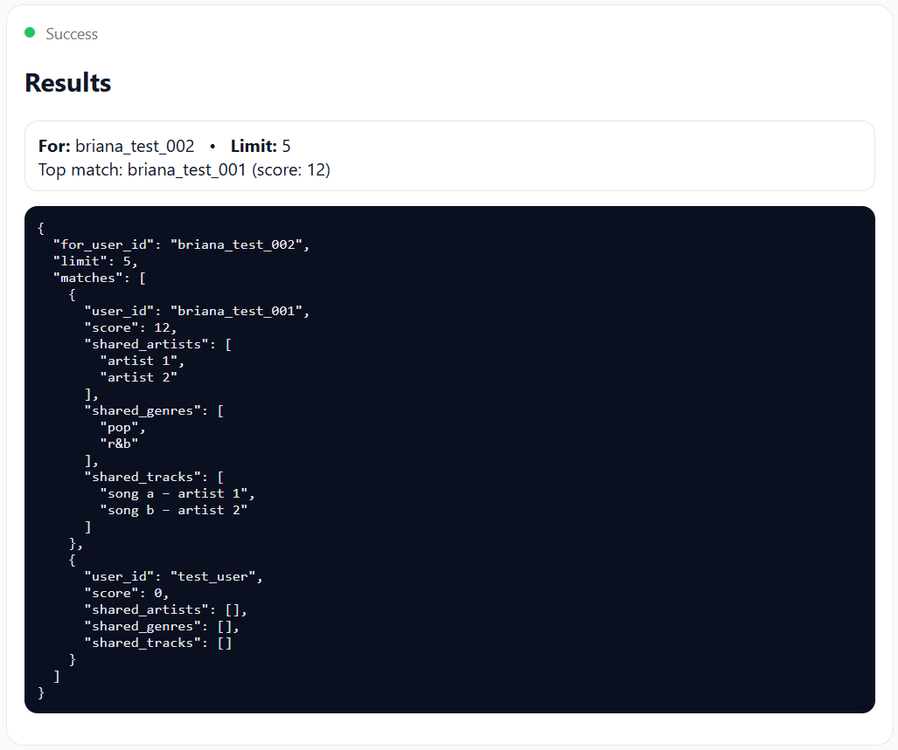

# Music Soulmate Finder 💚 (AWS Serverless)

A lightweight serverless backend that builds and stores music taste profiles and returns **ranked “music soulmate” matches** using a simple, explainable scoring algorithm.

> Portfolio project: API Gateway → AWS Lambda (Python) → DynamoDB

---

## Why this exists (Problem → Solution)

**Problem:** Music-based matching systems often become opaque “black boxes” or require full applications with authentication, large datasets, and complex pipelines.

**Solution:** This project keeps the scope intentionally small and clear:
- Store each user’s music taste profile in DynamoDB
- Compare users using a transparent scoring formula
- Return ranked matches through a simple API endpoint

The result is easy to demo, easy to explain, and easy to extend.

---

## What it does

### ✅ Features
- Build a **music taste profile** (artists, genres, tracks)
- Persist profiles in DynamoDB using `user_id`
- Compute **ranked matches** between users
- Return shared artists / genres / tracks with scores
- Minimal demo client (plain HTML + JS) for browser proof

---

## Tech Stack (AWS-focused)

- **API Gateway (HTTP API)** — public endpoints
- **AWS Lambda (Python)** — profile storage & matching logic
- **Amazon DynamoDB** — persistent profile storage (on-demand)
- **CloudWatch Logs** — debugging and execution proof
- *(Optional)* demo client: plain HTML/CSS/JS

---

## Architecture

Browser Demo
|
v
API Gateway (HTTP API)
|
v
AWS Lambda (Python)

build/store profile

compute matches
|
v
DynamoDB (Profiles Table)

---

## API Endpoints

### `GET /matches/{user_id}?limit=10`

Returns a ranked list of the most similar users.

**Example response**
```json
{
  "for_user_id": "briana_test_002",
  "limit": 10,
  "matches": [
    {
      "user_id": "spotify:user:abc",
      "score": 12,
      "shared_artists": ["NCT 127"],
      "shared_genres": ["k-pop"],
      "shared_tracks": ["Sticker"]
    }
  ]
}
```

## How matching works (Simple + explainable)

Each pair of users receives a score:

score =
  (shared_artists * 3)
+ (shared_genres  * 2)
+ (shared_tracks  * 1)

Steps:

1. Fetch the current user’s profile
2. Scan other profiles in DynamoDB
3. Compute score + shared elements
4. Sort descending
5. Return top N matches

Why these weights?
- Artists → strongest signal
- Genres → broader signal
- Tracks → can be one-off listens

## DynamoDB Data Model
- Partition key: user_id (string)
- Attributes: taste profile data

Example:
```json
{
  "user_id": "briana_test_002",
  "taste_profile": {
    "top_artists": ["..."],
    "top_genres": ["..."],
    "top_tracks": ["..."]
  }
}
```
## Proof / Screenshots
### DynamoDB profile stored

### Match endpoint response

### API Gateway routes

### Demo client success


## Running the demo

The demo is a plain HTML/JS page that calls the API.

1. Set your API base URL in:
```bash
demo/app.js
```

2. Run a local static server:
```bash
cd demo
python3 -m http.server 5500
```

3. Open:
http://localhost:5500

## Future Improvements
- Spotify OAuth (real user identity)
- Authentication / rate limiting
- Improved scoring (normalization, sparse profiles)
- Avoid full table scans (indexes or precomputed matches)
- User preferences (hide artists/tracks, time range toggle)

## Notes
This project is intentionally small and demo-friendly, but structured like a real backend system: clean APIs, persistent storage, explainable logic, and proof screenshots.