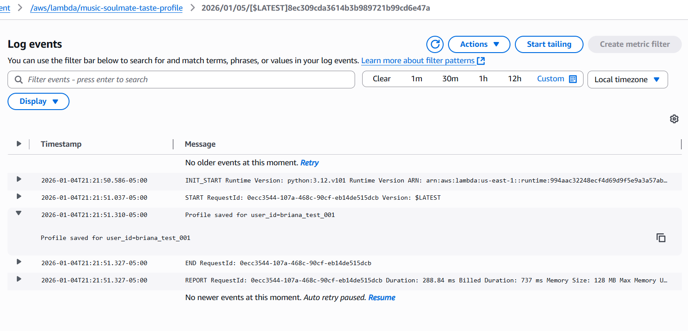

# Music Soulmate Finder 💚

A serverless, AWS-based backend that builds music taste profiles and returns ranked “music soulmate” matches based on shared artists, genres, and tracks.

## Why this project
I built this project to demonstrate real cloud engineering skills using AWS serverless services, including API design, data modeling, and an explainable matching algorithm — all within AWS Free Tier limits.

## What’s working
- ✅ **POST `/taste-profile`** builds and stores a user’s taste profile in DynamoDB
- ✅ **GET `/matches/{user_id}`** returns ranked music matches
- ✅ Optional `limit` query parameter supported
- ✅ Matching logic is explainable (shared artists, genres, tracks included)
- ✅ CloudWatch Logs used for debugging and verification

---

## How it works (2-minute overview)

1) **Build taste profile**  
A Lambda function processes Spotify listening data and creates a normalized taste profile.

2) **Store profile**  
The profile is saved in DynamoDB using `user_id` as the partition key (overwritten on updates).

3) **Find matches**  
To find music soulmates, the system:
- loads the current user profile
- scans other stored profiles
- computes a similarity score
- sorts results
- returns the top matches

### Architecture (AWS)

Client  
↓  
API Gateway (HTTP API)  
↓  
Lambda (Python)  
↓  
DynamoDB (Profiles)

---

## API

**Base URL**
https://7rn3olmit4.execute-api.us-east-1.amazonaws.com

### Endpoints

- **POST `/taste-profile`**  
  Builds a taste profile and stores it in DynamoDB.

- **GET `/matches/{user_id}`**  
  Returns ranked matches for a given user.

- **Optional query parameter**
?limit=5

### Example request
GET /matches/briana_test_002?limit=5

### Example response
```json
[
  {
    "user_id": "briana_test_001",
    "score": 12,
    "shared_artists": ["NCT 127"],
    "shared_genres": ["k-pop"],
    "shared_tracks": ["Fact Check"]
  }
]
```

## Tech stack (AWS-focused)
- AWS Lambda (Python 3.12) — taste profile and matching logic
- Amazon API Gateway (HTTP API) — REST endpoints
- Amazon DynamoDB — user profile storage
- Amazon CloudWatch Logs — debugging and proof of execution

## Quick test (PowerShell)
```powershell
$BASE = "https://7rn3olmit4.execute-api.us-east-1.amazonaws.com"
Invoke-RestMethod "$BASE/matches/briana_test_002"
Invoke-RestMethod "$BASE/matches/briana_test_002?limit=5"
```

## Project documentation
- Architecture: docs/week3/aws-architecture.md
- Profile storage: docs/week3/profile-storage.md
- Matching logic: docs/week3/matching-logic.md

## Proof (screenshots)
  
  


## Future improvements
- Spotify OAuth authentication
- Improved matching weights and normalization
- Short / medium / long-term Spotify data toggle
- Ability to hide artists or tracks (frontend first, DynamoDB later)